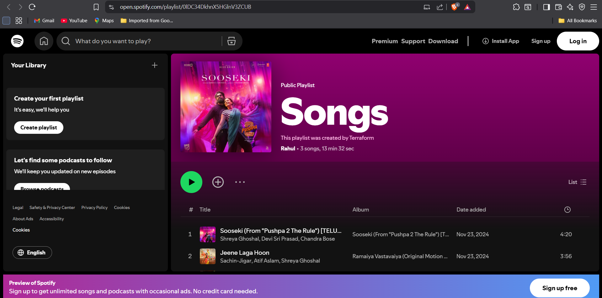

# 🎵 Terraform Spotify Playlist Automation  

Automate the creation and management of Spotify playlists using **Terraform**.  
This project demonstrates applying **Infrastructure as Code (IaC)** and **DevOps best practices** to orchestrate SaaS APIs, providing a reusable workflow and secure automation for playlist management on Spotify.  

---

## 📌 Project Overview
- Automates **Spotify playlist creation** using Terraform.  
- Uses the [community Spotify Terraform provider](https://registry.terraform.io/providers/conradludgate/spotify/latest).  
- Demonstrates **OAuth 2.0 authentication** via a Dockerized authorization proxy.  
- Showcases **IaC workflow, API-driven automation, and secrets handling**.  

---

## 🛠 Tech Stack
- **Terraform** — Infrastructure as Code tool.  
- **Spotify API** — SaaS integration for playlist automation.  
- **Docker** — Runs the Spotify authorization proxy server.  
- **Skills demonstrated**: IaC, API automation, OAuth, Docker, DevOps automation  

---

## ⚙️ Architecture & Workflow

1. Terraform configuration (`provider.tf`, `playlist.tf`, `variable.tf`). 
2. Terraform uses the **Spotify provider** to translate resources into API requests.  
3. Authorization Proxy (Docker container) manages OAuth tokens securely.  
4. Spotify API receives and executes the requests.  
5. A new Spotify playlist is created in your account.  

  

---

## 🚀 Getting Started  

### ✅ Prerequisites
- [Terraform](https://www.terraform.io/downloads.html), v1.0+  
- [Docker Desktop](https://docs.docker.com/get-docker/)  
- Spotify account  
- Git  

---
### Setup Instructions
### 1. Create a Spotify Developer App
1. Go to the [Spotify Developer Dashboard](https://developer.spotify.com/dashboard).  
2. Click **Create an app** → give it a name (e.g., `Terraform Playlist Demo`) and description.  
3. Add this Redirect URI:  
   http://localhost:27228/spotify_callback
4. Save the app.
5. Click **Show client secret** and copy both Client ID and Client Secret.

### 2. Configure Authorization Proxy
The proxy enables Terraform to authenticate with Spotify using OAuth.  

```bash
   # Set redirect URI
   export SPOTIFY_CLIENT_REDIRECT_URI=http://localhost:27228/spotify_callback

   # Create .env file with credentials
   echo "SPOTIFY_CLIENT_ID=your-client-id" >> .env
   echo "SPOTIFY_CLIENT_SECRET=your-client-secret" >> .env

   # Run the proxy with Docker
   docker run --rm -it \
   -p 27228:27228 \
   --env-file .env \
   ghcr.io/conradludgate/spotify-auth-proxy:latest
```
Keep this container running in your terminal. It will handle authentication.

### 3. Terraform Configuration

This repo already includes the Terraform configuration split into:

- `provider.tf` — sets up the Spotify provider
- `playlist.tf` — defines the playlist resource(s)
- `variable.tf` — input variables (playlist name, tracks, etc.)

Example resource (from `playlist.tf`):

```hcl
resource "spotify_playlist" "demo" {
  name        = var.playlist_name
  description = "Created with Terraform!"
  public      = false

  tracks = var.tracks
}
```

### 4. Run Terraform

With the proxy running, initialize and apply Terraform:
```bash
   terraform init
   terraform plan
   terraform apply
 ```
Terraform will:

- Authenticate via the proxy  
- Create a new playlist in your Spotify account  
- Add tracks defined in `playlist.tf` / `variable.tf`

## ✅ Output

After running terraform apply, you should see:

🎶 A new playlist created in your Spotify account

🎵 Tracks automatically added as defined in your configuration



## 💡 Why This Matters

This project shows how Terraform can manage SaaS APIs just like cloud infrastructure:

Playlists as code (reproducible, version-controlled).

OAuth handled securely via a proxy.

Real-world demonstration of IaC + DevOps principles beyond infrastructure.
